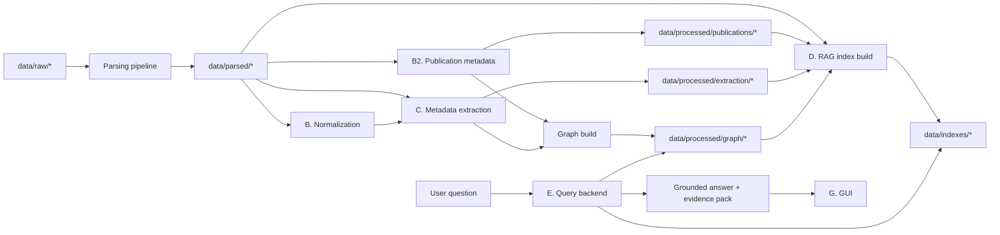

# План разработки RAG + Graph решения для Task 2

Дата актуализации: 2026-07-03.

Это главный план проекта. Если есть расхождение с другими заметками в
`hackathon_plan/`, источником истины считается этот файл.

Официальное условие: https://nornickel-ai-hackathon.ru/task-2

## 1. Текущее состояние

Парсинг корпуса уже выполнен и является read-only входом для следующих этапов.

- `1862/1862` parse targets обработаны.
- `0 failed`, `0 unsupported`.
- `1857 ok`, `5 empty` PDF под будущий OCR.
- `89 703` chunks.
- `5 507` table previews.
- `1 862` full-text файлов.
- `4 190` CSV-файлов с полными Excel-листами.
- Полный переносимый архив лежит в `C:\Users\user\YandexDisk\Норникель_хакатон\parsed_artifacts\parsed_corpus_full.zip`.

Главные входные файлы для разработки:

- `data/parsed/documents.jsonl`
- `data/parsed/chunks.jsonl`
- `data/parsed/tables.jsonl`
- `data/parsed/full_texts/*.txt`
- `data/parsed/spreadsheets_csv/**/*.csv`

Эти файлы не редактируются руками. Если нужен новый парсинг или догрузка файлов,
используется `scripts/update_parsed_corpus.py`.

## 2. Что строим

Финальное MVP: гибридная поисково-аналитическая система для R&D корпуса.

Система должна:

- отвечать на естественные вопросы по документам;
- находить source evidence: документы, chunks, таблицы, CSV-листы;
- поддерживать семантический поиск по chunks;
- поддерживать точный поиск по терминам, формулам, маркам, числам;
- поддерживать typed metadata filters: температура, давление, концентрация,
  скорость потока, география, год, источник, уровень достоверности;
- строить граф только по официальной онтологии задания;
- показывать связанные сущности, пробелы и противоречия;
- давать ответ с citations, а не свободную генерацию без доказательств;
- работать онлайн за 3-5 секунд на заранее построенных индексах;
- иметь понятный GUI для демонстрации.

## 3. Требования организаторов

Технические требования из задания, которые прямо влияют на архитектуру:

| Требование | Архитектурное решение |
|---|---|
| Сложные многопараметрические запросы: материал + процесс + условия + география + период | Query parser выделяет slots; retrieval применяет dense + lexical + typed filters + graph expansion |
| Источник, достоверность, дата актуализации | Каждый факт, ребро, candidate и ответ несут `doc_id`, `chunk_id`, `source_span_id`, `confidence`, `extracted_at` |
| Отечественная и зарубежная практика | География нормализуется отдельно; query layer может фильтровать `country`, `region`, `facility`, `practice_scope` |
| Числовые диапазоны | Числа нельзя надежно искать только embeddings; нужен `numeric_conditions` store с unit normalization |
| Граф знаний | Используем официальные типы узлов и ребер; расширения кладем в attributes, а не плодим новые типы узлов |
| Семантический поиск | Индекс chunks через Yandex AI Studio embeddings; query embeddings отдельной query-моделью |
| Визуализация графа | GUI показывает mini-graph по найденным сущностям и 1-2 hop neighbors |
| Пробелы и противоречия | Graph/extraction помечают missing combinations и `contradicts`; answer layer показывает gaps |
| RBAC, безопасность, аудит | Для MVP фиксируем архитектуру: роли, query/export audit log, no secrets in git |
| Производительность 3-5 секунд при масштабе до 1 млн сущностей | Все тяжелое offline: parsing, embeddings, graph, summaries; online только lookup, rerank, short LLM answer |
| Экспорт | Evidence table в CSV/JSON, graph в GraphML/JSON, отчет в Markdown/PDF |

## 4. Архитектура



Ключевой принцип: `data/parsed/*` read-only; каждый downstream-модуль пишет
только в свою папку `data/processed/<module>/` или `data/indexes/`.

## 5. Официальная предметная модель графа

В MVP используем ровно типы из условия.

Типы узлов:

- `Material`
- `Process`
- `Equipment`
- `Property`
- `Experiment`
- `Publication`
- `Expert`
- `Facility`

Типы ребер:

- `uses_material`
- `operates_at_condition`
- `produces_output`
- `described_in`
- `validated_by`
- `contradicts`

Что не делаем отдельными узлами в MVP:

- `Location`
- `Measurement`
- `Claim`
- `Version`
- `Chunk`
- `Condition`

Их храним как attributes и provenance:

- география: `Facility.location`, `country`, `region`, `practice_scope`;
- числа: `numeric_conditions.jsonl` и attributes ребра `operates_at_condition`;
- источники: `Publication`, `source_spans.jsonl`, `doc_id`, `chunk_id`;
- версии: `source_date`, `extracted_at`, `version_label`;
- chunks: только provenance, не graph node.

## 6. Непересекающиеся области разработки

### A. Corpus parsing

Статус: почти закрыто, пока только поддержка догрузки.

Можно менять:

- `app/ingest/*`
- `app/parsing/*`
- `app/quality/*`
- `scripts/update_parsed_corpus.py`
- `scripts/parse_corpus.py`
- `scripts/run_parse_batches.py`
- `scripts/prepare_derived_files.py`
- `scripts/reparse_problem_documents.py`
- `scripts/build_parsing_report.py`

Пишет:

- `data/parsed/*`
- `reports/parsing/*`

Нельзя менять без согласования:

- JSONL-схему `documents.jsonl`, `chunks.jsonl`, `tables.jsonl`.

### B. Normalization

Цель: канонизация материалов, месторождений, стран, регионов, свойств, единиц,
синонимов.

Можно менять:

- `app/normalization/*`
- `config/normalization/*`
- `scripts/build_normalization.py`

Пишет:

- `data/processed/normalization/canonical_entities.jsonl`
- `data/processed/normalization/entity_aliases.jsonl`
- `data/processed/normalization/unit_mappings.jsonl`
- `data/processed/normalization/geo_aliases.jsonl`
- `data/processed/normalization/normalization_overrides.csv`

Нельзя менять:

- `data/parsed/*`
- `app/rag/*`
- `app/index/*`
- `data/indexes/*`

### B2. Publication metadata

Цель: отдельно извлечь библиографическую metadata источников корпуса, чтобы
`Publication` nodes строились из нормализованного `publications.jsonl`, а не
переизвлекались из каждого chunk.

Подробное ТЗ и schema: [`tasks/02_publication_metadata/`](tasks/02_publication_metadata/).

Минимальный контракт:

- `publication_id`, `doc_id`, `document_kind`, `source_type`;
- `title`, `authors`, `year`, `venue_name`, `venue_type`, `doi`;
- `source_path`, `file_name`, `extension`;
- `embedded_metadata`, `confidence`, `missing_fields`, `evidence`.

Можно менять:

- `app/extract/*`
- `config/extraction/publication_metadata.json`
- `scripts/extract_publication_metadata.py`
- `tasks/02_publication_metadata/*`

Пишет:

- `data/processed/publications/publications.jsonl`
- `data/processed/publications/publication_authors.jsonl`
- `data/processed/publications/publication_venues.jsonl`
- `data/processed/publications/publication_evidence_spans.jsonl`
- `data/processed/publications/publication_metadata_report.json`

Нельзя менять:

- `app/rag/*`
- `app/index/*`
- `data/indexes/*`
- `data/parsed/*` вручную.

### C. Metadata extraction + RECIPER + graph

Это зона для второго разработчика.

Цель: извлечь typed facts, procedure summaries, nodes/edges официального графа и
provenance. Для `Publication` nodes сначала читать
`data/processed/publications/publications.jsonl`, если он уже построен.

Можно менять:

- `app/extract/*`
- `app/graph/*`
- `config/extraction/*`
- `config/graph/*`
- `scripts/extract_metadata.py`
- `scripts/build_graph.py`

Пишет:

- `data/processed/extraction/entity_mentions.jsonl`
- `data/processed/extraction/numeric_conditions.jsonl`
- `data/processed/extraction/facts.jsonl`
- `data/processed/extraction/relations.jsonl`
- `data/processed/extraction/procedure_summaries.jsonl`
- `data/processed/extraction/source_spans.jsonl`
- `data/processed/graph/nodes.jsonl`
- `data/processed/graph/edges.jsonl`
- `data/processed/graph/graph_stats.json`

Нельзя менять:

- `app/rag/*`
- `app/index/*`
- `scripts/build_indexes.py`
- `scripts/search_cli.py`
- `data/indexes/*`
- RAG scoring без согласования контракта.

Минимальная schema для `entity_mentions.jsonl`:

```json
{
  "mention_id": "ment_...",
  "doc_id": "doc_id",
  "chunk_id": "chunk_id",
  "source_span_id": "span_...",
  "entity_type": "Material",
  "raw_text": "nickel matte",
  "canonical_id": "mat_...",
  "confidence": 0.82
}
```

Минимальная schema для `relations.jsonl`:

```json
{
  "relation_id": "rel_...",
  "source_id": "exp_...",
  "target_id": "mat_...",
  "type": "uses_material",
  "doc_id": "doc_id",
  "chunk_id": "chunk_id",
  "source_span_id": "span_...",
  "attributes": {},
  "confidence": 0.78
}
```

Минимальная schema для `procedure_summaries.jsonl`:

```json
{
  "procedure_id": "proc_sum_...",
  "doc_id": "doc_id",
  "chunk_id": "chunk_id",
  "source_span_id": "span_...",
  "summary": "Material, operation, conditions, equipment, output, property effect.",
  "materials": ["mat_..."],
  "processes": ["proc_..."],
  "conditions": [{"parameter": "temperature", "value": 900, "unit": "C"}],
  "confidence": 0.75
}
```

RECIPER здесь не отдельный RAG-бот. Это дополнительная retrieval-view:

1. extraction находит procedure-like chunks;
2. LLM делает компактные summaries процедур;
3. RAG строит отдельный индекс `procedure_summary_vectors`;
4. online retrieval объединяет chunks + procedure summaries + graph + filters.

### D. RAG retrieval/index

Это наша текущая зона.

Цель: построить dense vector index, lexical index, retrieval API, hybrid rerank.

Можно менять:

- `app/rag/*`
- `app/index/*`
- `config/retrieval/*`
- `scripts/build_indexes.py`
- `scripts/search_cli.py`

Пишет:

- `data/indexes/chunks/vector.npy`
- `data/indexes/chunks/metadata.jsonl`
- `data/indexes/chunks/manifest.json`
- `data/indexes/chunks/embedding_cache.jsonl`
- `data/indexes/lexical/*`
- `data/indexes/procedure_summaries/*`
- `data/indexes/retrieval_test_results.jsonl`

Читает, но не редактирует:

- `data/parsed/*`
- `data/processed/extraction/*`
- `data/processed/graph/*`

Нельзя менять:

- `app/extract/*`
- `app/graph/*`
- extraction/graph schemas без согласования.

Выбор модели:

- documents/chunks: Yandex AI Studio `emb://<folder_id>/text-embeddings-v2-doc/`;
- user queries: Yandex AI Studio `emb://<folder_id>/text-embeddings-v2-query/`;
- fallback, если v2 нестабилен: `emb://<folder_id>/text-search-doc/latest` и
  `emb://<folder_id>/text-search-query/latest`.

Почему так:

- у Yandex есть отдельные doc/query embedding-модели;
- API разрешен в рамках кейса;
- не нужен OpenAI/Anthropic;
- 256/512/768 dimensionality можно масштабировать под бюджет и RAM.

Первый алгоритм vector search:

1. Берем `data/parsed/chunks.jsonl`.
2. Для каждого chunk считаем embedding document-моделью.
3. Сохраняем `float32` матрицу и metadata отдельно.
4. L2-нормализуем vectors.
5. На запросе считаем query embedding, нормализуем, ищем top-k через dot product.
6. Для памяти читаем matrix chunked/memmap, не грузим лишние payload.

План hybrid retrieval:

1. Dense top-k по embeddings.
2. Lexical top-k через SQLite FTS5 или TF-IDF/BM25 fallback.
3. Metadata filters: числа, география, source type, year.
4. Graph/procedure candidates, когда C будет готов.
5. Reciprocal rank fusion или weighted score.
6. Rerank top-N по typed constraint match и source confidence.

### E. Query backend / answer composer

Цель: принять вопрос, выделить intent/slots, вызвать retrieval, собрать answer.

Можно менять:

- `app/query/*`
- `config/query/*`
- `scripts/run_query.py`

Пишет:

- `data/processed/query/audit_log.jsonl`
- `data/processed/query/demo_answers.jsonl`

Нельзя менять:

- index builders;
- extraction builders;
- GUI layout без согласования.

### F. Evaluation

Цель: доказать качество и скорость.

Можно менять:

- `app/eval/*`
- `scripts/evaluate_*.py`
- `eval/*`
- `config/eval/*`

Минимальные метрики:

- Retrieval: Recall@5/10, nDCG@10, MRR, citation hit rate.
- Extraction: JSON validity, entity precision, relation precision, evidence coverage.
- Numeric/geo: range filter accuracy, unit normalization accuracy.
- Graph: graph query success, contradiction precision.
- Answer: faithfulness, completeness, abstention quality.
- Performance: P50/P95 latency, index size, API cost.

### G. GUI / demo

Цель: показать ценность системы жюри и эксперту.

Можно менять:

- `app/ui/*`
- `config/ui/*`
- `scripts/run_demo.py`
- `hackathon_plan/ux/*`

MVP экран:

- поле вопроса;
- фильтры material/process/property/range/geo/source;
- вкладки `Answer`, `Evidence`, `Graph`, `Gaps`, `Sources`, `Benchmarks`;
- export evidence CSV/JSON;
- export graph GraphML/JSON;
- feedback: correct/incorrect entity/relation.

Нельзя:

- импортировать parser/extraction/index builders напрямую;
- менять `data/indexes/*` или `data/processed/graph/*` из GUI.

## 7. CSV и таблицы

Excel CSV не индексируем целиком в dense chunks.

Правильный сценарий:

1. `chunks.jsonl` содержит compact preview Excel-листа.
2. По найденному `doc_id` и `metadata_json` открываем нужный `csv_path`.
3. CSV читаем лениво: только нужный sheet и только нужные строки/колонки.
4. Metadata extraction может отдельно пройтись по CSV для чисел, единиц,
   диапазонов, заголовков и географии.
5. В answer отдаваем не весь CSV, а evidence rows + ссылку на source CSV.

Будущий helper:

- `app/index/spreadsheet_store.py` или `app/rag/spreadsheet_store.py`;
- функции: `get_workbook_sheets(doc_id)`, `read_sheet_preview(csv_path)`,
  `find_rows(csv_path, query_terms, numeric_filters)`.

## 8. Модели и API

Секреты:

- `YANDEX_API_KEY` и `YANDEX_FOLDER_ID` лежат только в `.env`;
- `.env` не коммитится;
- в логах нельзя печатать ключи.

Yandex AI Studio:

- embeddings: `text-embeddings-v2-doc/query`;
- fallback embeddings: `text-search-doc/query/latest`;
- query rewrite: YandexGPT Lite;
- JSON extraction / answer over evidence: YandexGPT Pro.

RouterAI:

- оставить как fallback для LLM/extraction, если Yandex недоступен;
- не использовать OpenAI/Anthropic в финальном контуре;
- не включать provider fallbacks без явной настройки.

## 9. Приоритеты на ближайшую работу

### Сейчас параллельно

Работа 1, Metadata + graph:

1. Создать `app/extract/schemas.py`.
2. Создать `scripts/extract_metadata.py` на маленьком subset 50-100 chunks.
3. Реализовать regex extraction чисел/единиц/температур/давлений.
4. Реализовать LLM JSON extraction по candidate chunks.
5. Сохранить `entity_mentions`, `numeric_conditions`, `relations`,
   `procedure_summaries`.
6. Собрать `nodes.jsonl`, `edges.jsonl`, `source_spans.jsonl`.

Работа 2, RAG:

1. Создать `config/retrieval/default.json`.
2. Создать Yandex embeddings client.
3. Создать `scripts/build_indexes.py`.
4. Построить dense index по chunks с resume/cache.
5. Создать `scripts/search_cli.py`.
6. Добавить lexical baseline.
7. Добавить hybrid scoring.

### После первых результатов

1. Query backend: `scripts/run_query.py`.
2. GUI: Streamlit или Gradio.
3. Demo questions и evaluation.
4. Graph expansion в RAG, когда graph outputs будут готовы.
5. Procedure summary index, когда `procedure_summaries.jsonl` будет готов.

## 10. Definition of Done для ближайшего MVP

RAG считается готовым для первого demo, если:

- `scripts/build_indexes.py --limit 1000` строит index без ручных действий;
- `scripts/search_cli.py "..."` возвращает top-k chunks с `doc_id`, `chunk_id`,
  score и source path;
- поиск работает без LLM;
- индекс можно удалить и пересобрать;
- API ключи не попадают в git;
- есть README/команда запуска.

Metadata + graph считается готовым для интеграции, если:

- extraction запускается на subset;
- все JSONL валидируются Pydantic-схемами;
- graph содержит только 8 типов узлов и 6 типов ребер;
- каждое ребро имеет evidence;
- `procedure_summaries.jsonl` ссылается на исходные chunks.

GUI считается готовым для demo, если:

- можно задать вопрос;
- видно answer/evidence/sources;
- graph tab не падает, если граф пустой;
- gaps показываются явно;
- есть экспорт evidence.

## 11. Правила совместной разработки

1. Перед началом работы каждый берет одну область: C или D.
2. Не менять чужие директории без отдельного согласования.
3. Не менять `data/parsed/*` руками.
4. Все generated data остаются вне git: `data/processed`, `data/indexes`,
   `reports`, `artifacts`.
5. Любое изменение JSONL-контракта фиксируется в этом файле.
6. Secrets не печатать, не коммитить, не добавлять в README.
7. Малые проверки обязательны: compileall, smoke run на limit/subset.
8. Для долгих API jobs нужен resume/cache.

## 12. Минимальные команды

Проверить парсинг:

```powershell
.\.venv\Scripts\python.exe scripts\update_parsed_corpus.py --dry-run --mode incremental --batch-size 10 --max-batches 1 --package
```

Будущий RAG index smoke:

```powershell
.\.venv\Scripts\python.exe scripts\build_indexes.py --limit 1000 --resume
.\.venv\Scripts\python.exe scripts\search_cli.py "методы обессоливания воды при сульфатах 200 мг/л"
```

Будущий extraction smoke:

```powershell
.\.venv\Scripts\python.exe scripts\extract_metadata.py --limit 100
.\.venv\Scripts\python.exe scripts\build_graph.py
```

## 13. Что сдаем

По условию нужно подготовить:

- ссылку на GitHub/GitLab репозиторий;
- архив исходного кода;
- ссылку на облачный диск с материалами;
- видео-demo не длиннее 5 минут;
- презентацию;
- ссылку на развернутое решение, если успеем.

Минимальная линия защиты: "Мы построили не чат по PDF, а модульную
поисково-аналитическую систему: parsed corpus -> vector/lexical retrieval ->
typed metadata -> graph evidence -> grounded answer with citations".
