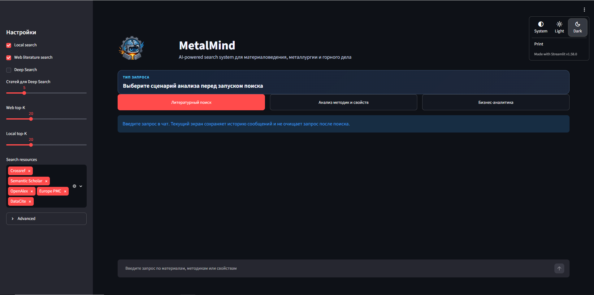

# MetalMind

AI-powered search system для материаловедения, металлургии и горного дела.

Решение было разработано в рамках хакатона Норникеля по задаче анализа научно-технического корпуса.



## Какие проблемы решаем

- Ускоряем литературный обзор по сложным инженерным и научным запросам.
- Объединяем разрозненные PDF, DOCX, XLSX, PPTX, таблицы и внешние публикации в единую поисковую систему.
- Помогаем сравнивать локальную базу знаний с мировой практикой.
- Даем проверяемые ответы со ссылками на источники, а не только генеративный текст.
- Снижаем ручную работу экспертов при поиске методик, свойств, условий экспериментов и технико-экономических факторов.

## Что умеет система

- Локальный RAG по корпусу документов.
- Web literature search по научным базам: Crossref, Semantic Scholar, OpenAlex, Europe PMC, DataCite.
- LLM-переформулировка запроса, перевод и выделение ключевых слов.
- Deep Search: извлечение summary из найденных web-источников и сравнение с локальными материалами.
- Knowledge graph по материалам, процессам, свойствам, условиям, публикациям и связям между ними.
- Поиск по таблицам и Excel-артефактам.
- Генерация DOCX/PDF-отчетов и ZIP-архивов с релевантными материалами.

## Архитектура

- **Parsing layer**: извлекает текст, таблицы и метаданные из PDF/DOCX/PPTX/XLSX.
- **RAW RAG**: ищет по исходным фрагментам документов.
- **Summary RAG**: ищет по извлеченным summary публикаций и методик.
- **Hybrid retrieval**: объединяет dense embeddings, lexical search и summary search через RRF-ранжирование.
- **Knowledge graph**: хранит связи между материалами, процессами, свойствами, условиями и источниками.
- **Web layer**: ищет внешнюю литературу и нормализует metadata найденных публикаций.
- **LLM layer**: формирует ответы, сравнительные выводы и отчеты на русском языке.
- **Streamlit GUI**: пользовательский интерфейс для запуска сценариев и выгрузки результатов.

## Технические характеристики

- **Embedding-модель основного профиля**: `baai/bge-m3` через RouterAI, единое 1024-мерное embedding-пространство для RAW chunks, document summaries и procedure summaries.
- **Дополнительный embedding-профиль**: Yandex AI Studio `text-search-doc/latest` / `text-search-query/latest`, 256 измерений, использовался как Yandex-first контур и fallback-совместимый индекс.
- **Inference-модель для ответов в демо**: RouterAI `deepseek/deepseek-chat-v3.1`; для extraction pipeline был настроен YandexGPT `yandexgpt-5.1/latest` с fallback на `yandexgpt-lite/latest`.
- **Объем базы знаний**: 1862 документа, 89 703 текстовых chunk, 5507 извлеченных таблиц, 1862 full-text файла, 4190 CSV-артефактов из Excel.
- **Индексы**: RAW vector + RAW lexical, document summary vector, procedure summary vector, summary lexical; основной RouterAI BGE-M3 индекс содержит 89 703 RAW-вектора, 1862 document-summary вектора и 879 procedure-summary векторов.
- **Размер локальных артефактов**: около 12.3 GB в `data/`, включая raw-корпус, parsed/processed данные и индексы; сами индексы занимают около 4.3 GB.
- **Модальности**: PDF, DOCX, PPTX, XLSX/XLS, CSV, таблицы, full-text, metadata, summary, procedure summaries, web-publication metadata.
- **Работа с модальностями**: документы парсятся в текстовые chunk, таблицы и Excel-листы сохраняются как отдельные structured artifacts, summary используются для отдельного Summary RAG, а связи между материалами/процессами/свойствами выносятся в knowledge graph.

## Агентный инжиниринг

- Разработка велась через набор специализированных агентных задач: парсинг корпуса, извлечение summary, построение индексов, graph enrichment, RAG-интеграция, GUI и отчетность.
- Для долгих фоновых процессов использовались watcher-агенты: они проверяли доступность API, запускали векторизацию, писали статус в логи и не блокировали основную разработку.
- Для качества применялись отдельные роли/циклы: bugfix-loop, test-generation, code-review и acceptance-прогоны по реальным пользовательским сценариям.
- `tasks/` использовался как контракт между агентами: в каждой задаче фиксировались зона файлов, ограничения, команды запуска и критерии готовности.
- Такой подход позволил параллельно развивать RAG, web search, граф, бизнес-сценарий и Streamlit GUI без остановки длительного парсинга/индексации.

## Основные сценарии

1. **Литературный поиск**  
   Ищет релевантные локальные и внешние публикации, строит обзор и список источников.

2. **Анализ методик и свойств**  
   Сравнивает методики, свойства, условия экспериментов и evidence из RAW RAG, Summary RAG, таблиц и графа.

3. **Бизнес-аналитика**  
   Собирает технико-экономический контекст: энергозатраты, реагенты, CAPEX/OPEX-драйверы, рыночные и производственные показатели.

## GUI

Интерфейс сделан на Streamlit в формате чат-системы:

- выбор сценария анализа;
- отдельные настройки local/web search;
- настройка Top-K для локального и внешнего поиска;
- опциональный Deep Search;
- таблицы релевантных источников;
- графики по годам, базам данных и покрытию evidence;
- скачивание отчетов в DOCX/PDF и архивов с материалами.

## Быстрый запуск

```powershell
py -3.12 -m venv .venv
.\.venv\Scripts\python.exe -m pip install -r requirements.txt
.\.venv\Scripts\python.exe scripts\run_demo_app.py --background --address 127.0.0.1
```

Локальный интерфейс:

```text
http://127.0.0.1:8501/
```

## Данные и артефакты

- `app/` - основной код системы.
- `scripts/` - CLI-команды и сервисные запускаторы.
- `data/parsed/` - распарсенный корпус.
- `data/processed/` - summary, результаты поиска, отчеты и индексы.
- `data/indexes/` - RAW/Summary vector и lexical indexes.
- `docs/` - документация и изображения для README.

Большие данные, индексы и отчеты не предназначены для хранения в git.
