# Independent Development Workstreams

Дата обновления: 2026-07-03.

Цель этого документа - разделить разработку так, чтобы параллельная работа не конфликтовала по файлам и данным. Базовое правило: модули читают артефакты предыдущего слоя и пишут только в свою зону `app/*`, `scripts/*` и `data/processed/<module>/`. Общие схемы меняются только через согласованный контракт. Подробное техническое ТЗ по каждому блоку находится в `task2_actual/workstream_technical_specs.md`.

## 1. Поток данных

```mermaid
flowchart LR
    RAW["data/raw/yandex_task2/*"] --> PARSE["Corpus parsing"]
    PARSE --> PARSED["data/parsed/documents.jsonl<br/>data/parsed/chunks.jsonl<br/>data/parsed/tables.jsonl<br/>data/parsed/full_texts/*.txt"]

    PARSED --> NORM["Normalization"]
    NORM --> CANON["data/processed/normalization/*"]

    PARSED --> EXTRACT["Metadata extraction<br/>RECIPER procedure view"]
    CANON --> EXTRACT
    EXTRACT --> FACTS["data/processed/extraction/facts.jsonl<br/>relations.jsonl<br/>procedure_summaries.jsonl"]

    FACTS --> GRAPH["Graph build"]
    CANON --> GRAPH
    GRAPH --> GRAPH_DATA["data/processed/graph/nodes.jsonl<br/>edges.jsonl<br/>source_spans.jsonl"]

    PARSED --> RAG["RAG index build"]
    FACTS --> RAG
    GRAPH_DATA --> RAG
    RAG --> INDEXES["data/indexes/*"]

    USER["User question"] --> GUI["GUI / demo application"]
    GUI --> QUERY["Query backend"]
    QUERY --> RAG
    RAG --> ANSWER["Grounded answer + evidence + mini-graph"]
    ANSWER --> GUI
```



## 2. Непересекающиеся области

| Область | Что делает | Можно менять | Нельзя менять без согласования | Основные выходы |
|---|---|---|---|---|
| A. Corpus parsing | скачивание, инвентаризация, парсинг PDF/DOCX/PPTX/XLSX, чанки, full text | `app/ingest/*`, `app/parsing/*`, `app/quality/*`, `scripts/inventory_yandex_disk.py`, `scripts/download_dataset.py`, `scripts/parse_corpus.py`, `scripts/build_parsing_report.py`, `reports/parsing/*` | формат `data/parsed/documents.jsonl`, `chunks.jsonl`, `tables.jsonl` без обновления контракта | `data/parsed/*`, `reports/parsing/*` |
| B. Normalization | канонизация материалов, месторождений, стран, регионов, свойств, единиц, alias tables | `app/normalization/*`, `scripts/build_normalization.py`, `config/normalization/*`, `data/processed/normalization/*` | parser и RAG index internals | `canonical_entities.jsonl`, `entity_aliases.jsonl`, `unit_mappings.jsonl`, `geo_aliases.jsonl` |
| C. Metadata extraction + graph | RECIPER summaries, JSON extraction сущностей/отношений, numeric facts, source spans, graph nodes/edges | `app/extract/*`, `app/graph/*`, `scripts/extract_metadata.py`, `scripts/build_graph.py`, `config/extraction/*`, `data/processed/extraction/*`, `data/processed/graph/*` | normalization dictionaries как источник истины; RAG scoring без контракта | `facts.jsonl`, `relations.jsonl`, `procedure_summaries.jsonl`, `nodes.jsonl`, `edges.jsonl`, `source_spans.jsonl` |
| D. RAG retrieval/index | embeddings чанков, vector/BM25 indexes, metadata filters, reranking, retrieval API | `app/rag/*`, `app/index/*`, `scripts/build_indexes.py`, `scripts/search_cli.py`, `data/indexes/*`, `config/retrieval/*` | extraction schema и graph schema без согласования | `chunk_vectors`, `bm25_index`, `retrieval_candidates.jsonl` |
| E. Query backend / answer composer | обработка вопроса пользователя, intent/slots, уточнения, planner, grounded answer | `app/query/*`, `scripts/run_query.py`, `config/query/*` | low-level parsers/index builders; UI layout | `answer`, `evidence_pack`, `clarification_question` |
| F. Evaluation | контрольные вопросы, метрики, latency/cost, benchmark table | `app/eval/*`, `scripts/evaluate_*.py`, `eval/*`, `hackathon_plan/benchmarks/*` | продукционные индексы и extraction outputs | `metrics.json`, `baseline_report.md` |
| G. GUI / demo application | интерфейс запроса, фильтры, вкладки Answer/Evidence/Graph/Gaps/Sources/Benchmarks, экспорт, feedback | `app/ui/*`, `scripts/run_demo.py`, `config/ui/*`, `hackathon_plan/ux/*` | parser/extraction/index internals | Streamlit/Gradio app, export files, feedback log |

## 3. Контракты между областями

### Parsing -> все остальные

`data/parsed/documents.jsonl`:

- `doc_id`: стабильный id документа;
- `local_path`, `source_path`, `source_type`, `source_mime_type`;
- `parser`, `status`, `quality_label`, `errors`;
- `text_chars`, `page_count`, `table_count`;
- `full_text_path`: путь к полному извлеченному тексту;
- `text_preview`: только preview, не полный текст.

`data/parsed/chunks.jsonl`:

- `chunk_id`, `doc_id`, `chunk_index`;
- `text`, `text_chars`;
- `source_path`, `local_path`.

`data/parsed/tables.jsonl`:

- `table_id`, `doc_id`, `page_or_sheet`;
- `text`, `row_count`, `local_path`.

Этот слой считается read-only для областей B-F. Если нужно изменить chunking или добавить поля, меняется parser и обновляется этот раздел.

### Normalization -> extraction, graph, query

Минимальные файлы:

- `data/processed/normalization/canonical_entities.jsonl`
- `data/processed/normalization/entity_aliases.jsonl`
- `data/processed/normalization/unit_mappings.jsonl`
- `data/processed/normalization/geo_aliases.jsonl`

Ключевой контракт: downstream-модули используют `canonical_id`, но сохраняют `raw_text` и `source_span_id`, чтобы можно было объяснить нормализацию.

### Extraction -> graph/RAG

Минимальный факт:

```json
{
  "fact_id": "fact_001",
  "doc_id": "doc_001",
  "chunk_id": "chunk_001",
  "source_span_id": "span_001",
  "entity_type": "Material|Process|Equipment|Property|Experiment|Publication|Expert|Facility",
  "raw_text": "Cu-Ni concentrate",
  "canonical_id": "mat_001",
  "attributes": {},
  "confidence": 0.82
}
```

RECIPER contract: `procedure_summaries.jsonl` - это отдельная retrieval-view, а не отдельный финальный RAG. Extraction генерирует summaries с `doc_id/chunk_id/source_span_id`; RAG индексирует их в `procedure_summary_vectors`; answer composer использует их только как часть общего evidence pack.

Минимальная связь:

```json
{
  "relation_id": "rel_001",
  "source_id": "exp_001",
  "type": "uses_material|operates_at_condition|produces_output|described_in|validated_by|contradicts",
  "target_id": "mat_001",
  "doc_id": "doc_001",
  "chunk_id": "chunk_001",
  "source_span_id": "span_001",
  "attributes": {"temperature_c": 900},
  "confidence": 0.78
}
```

### Graph -> RAG/query/UI

Граф экспортируется таблично:

- `nodes.jsonl`: только 8 официальных типов узлов;
- `edges.jsonl`: только 6 официальных типов отношений;
- `source_spans.jsonl`: доказательства для узлов/ребер.

RAG не строит свои graph nodes. Он читает graph export и использует его для graph expansion и reranking.

### RAG -> Query/Answer

Retrieval API должен возвращать не просто текст, а evidence candidates:

```json
{
  "candidate_id": "cand_001",
  "chunk_id": "chunk_001",
  "doc_id": "doc_001",
  "text": "context text",
  "scores": {"vector": 0.81, "bm25": 12.4, "graph": 0.3, "rerank": 0.77},
  "matched_entities": ["mat_001", "proc_001"],
  "source": {"title": "doc title", "page": 12, "path": "source path"}
}
```

Query/Answer не пересчитывает embeddings и не меняет индексы. Он только вызывает retrieval и собирает compact evidence pack.

### Query/Answer -> GUI

GUI получает готовую структуру, а не сырые внутренности индексов:

```json
{
  "answer": "grounded answer text",
  "citations": [{"doc_id": "doc_001", "chunk_id": "chunk_001", "source_path": "source path"}],
  "evidence": [{"candidate_id": "cand_001", "text": "context", "score": 0.77}],
  "graph": {"nodes": [], "edges": []},
  "gaps": ["missing pressure data"],
  "clarification_question": null,
  "metrics": {"latency_ms": 2400}
}
```

GUI может писать feedback/audit logs, но не меняет graph/index напрямую.

## 4. Практические правила параллельной разработки

1. Не менять чужую область файлов без явного согласования.
2. Не редактировать `data/parsed/*` руками. Это воспроизводимый output parser-а.
3. Все большие/приватные артефакты остаются вне git: `data/raw`, `data/parsed`, `data/processed`, `data/indexes`, `.env`.
4. Любое изменение JSONL-схемы сопровождается обновлением этого документа и примером строки.
5. В PR/коммите указывать затронутую область: `parsing`, `normalization`, `extraction`, `graph`, `rag`, `query`, `eval`.
6. Общие настройки моделей и ключей не хардкодить. Использовать `.env` и placeholder-ы в `.env.example`.
7. GUI не импортирует parser/extraction builders напрямую. Он вызывает query/retrieval API или читает demo outputs.

## 5. Рекомендуемый порядок интеграции

1. Parsing фиксирует `documents/chunks/tables/full_texts` и отчет качества.
2. Normalization готовит первые alias/unit/geo dictionaries.
3. Extraction строит `facts/relations/procedure_summaries` на 50-100 документах.
4. Graph собирает nodes/edges и source spans.
5. RAG строит BM25/vector indexes по chunks и добавляет graph/procedure candidates.
6. Query backend собирает демонстрационные сценарии и answer composer.
7. GUI показывает Answer/Evidence/Graph/Gaps/Sources/Benchmarks и экспорт.
8. Evaluation сравнивает B0-B6 по одному набору вопросов.
