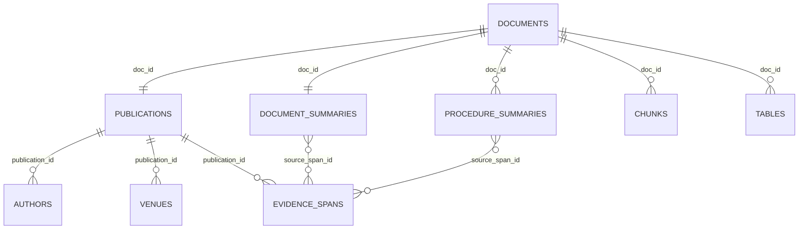

# Publication Metadata Data Contract

Дата обновления: 2026-07-04.

Этот документ описывает структуру данных, которые уже выделены на этапе
`Publication Metadata + RECIPER-style summaries`. Это upstream-контракт для
graph/RAG/GUI. Generated data лежат локально в `data/processed/publications/`
и не коммитятся.

## Source Of Truth

Основная папка артефактов:

```text
data/processed/publications/
```

Ключевые файлы:

| Файл | Назначение | Текущий размер |
|---|---|---:|
| `records/*.json` | Полный bundle на один `doc_id`: publication, authors, venue, summaries, procedures, evidence, LLM status. | 1862 |
| `publications.jsonl` | Одна нормализованная запись источника на `doc_id`. | 1862 |
| `document_summaries.jsonl` | Одна document-level summary запись на `doc_id`. | 1862 |
| `procedure_summaries.jsonl` | RECIPER-style procedure/experiment/process cards, 0..N на документ. | 879 |
| `publication_authors.jsonl` | Извлеченные авторы/эксперты/организации как publication-level metadata. | 948 |
| `publication_venues.jsonl` | Журналы, конференции, сборники, издатели. | 294 |
| `publication_evidence_spans.jsonl` | Evidence spans для проверки извлеченных фактов. | 21328 |
| `publication_metadata_manifest.json` | Последний run manifest: параметры, counts, workers, failed count. | 1 |
| `publication_quality_report.json` | QA по схемам, coverage, evidence refs, suspicious cases. | 1 |
| `summary_quality_report.json` | Sampled deterministic summary/procedure audit. | 1 |

## Identity And Joins

Главный стабильный ключ всей системы - `doc_id`.

`doc_id` приходит из `data/parsed/documents.jsonl` и связывает:

- raw RAG chunks: `data/parsed/chunks.jsonl`;
- table previews: `data/parsed/tables.jsonl`;
- full text: `data/parsed/full_texts/*.txt`;
- publication metadata: `publications.jsonl`;
- document summaries: `document_summaries.jsonl`;
- RECIPER-style procedure cards: `procedure_summaries.jsonl`;
- evidence spans: `publication_evidence_spans.jsonl`;
- будущие graph nodes/edges и RAG answers.

Derived ids:

- `publication_id = pub_<doc_id>`;
- `document_summary_id = docsum_<doc_id>`;
- `procedure_summary_id = proc_<doc_id>_<0001..N>`;
- `source_span_id = pubspan_<hash>`.

Практическая join-схема:



## Publication Records

File: `publications.jsonl`

Одна запись на каждый документ. Это seed для `Publication` nodes в графе и
source metadata для GUI/RAG.

Основные поля:

| Поле | Тип | Смысл |
|---|---|---|
| `publication_id` | string | Stable id: `pub_<doc_id>`. |
| `doc_id` | string | Главный foreign key. |
| `document_kind` | string | Тип источника: `journal_article`, `journal_issue`, `conference_paper`, `review_article`, `presentation_report`, `spreadsheet_dataset`, etc. |
| `source_type` | string | Исходная папка/категория корпуса: `Журналы`, `Обзоры`, `Материалы конференций`, etc. |
| `title` | string | Лучший извлеченный title с fallback на filename/header. |
| `title_confidence` | number | Доверие к title. |
| `language` | string | `ru`, `en`, `mixed`, `unknown`. |
| `year` | integer/null | Год публикации/источника, не blind file creation date. |
| `date_published` | string/null | Более точная дата, если найдена. |
| `authors` | array | Краткий список авторов внутри publication row. Детали в `publication_authors.jsonl`. |
| `organizations` | array | Организации/аффилиации/издатели/команды. |
| `venue_name` | string/null | Журнал, конференция, сборник. |
| `venue_type` | string/null | `journal`, `conference`, `publisher`, `dataset`, `unknown`. |
| `publisher` | string/null | Издатель, если найден. |
| `volume`, `issue`, `pages` | string/null | Библиографические поля. |
| `doi`, `isbn`, `url` | string/null | Идентификаторы источника. |
| `keywords`, `topic_tags` | array | Тематики и ключевые слова. |
| `abstract` | string/null | Аннотация, если есть. |
| `source_path`, `file_name`, `extension` | string | Где лежал исходный файл. |
| `embedded_metadata` | object | Метаданные файла/PDF/DOCX. Нельзя слепо считать библиографией. |
| `parser_metadata` | object | Parser, page/table/text stats. |
| `confidence` | number | Общая уверенность extraction. |
| `extraction_status` | string | `ok`, `partial`, etc. |
| `missing_fields` | array | Что не удалось достоверно извлечь. |
| `review_notes` | array | Notes вроде `llm_refusal_triaged`. |
| `evidence` | array | Refs на `source_span_id`. |

Downstream:

- graph builder создает `Publication` node из этой записи;
- RAG/GUI показывает title/year/source_path;
- все graph facts должны ссылаться обратно на `doc_id` и желательно на
  `publication_id`.

## Document Summary Records

File: `document_summaries.jsonl`

Одна запись на каждый документ. Это document-level overview, а не procedure
RAG. Использовать для triage, GUI cards, broad filtering, graph candidate
selection.

Основные поля:

| Поле | Смысл |
|---|---|
| `document_summary_id` | `docsum_<doc_id>`. |
| `publication_id`, `doc_id` | Join keys. |
| `summary` | 3-7 предложений: о чем документ, ключевые материалы/процессы/выводы. |
| `main_topic` | Главная тема документа. |
| `materials`, `processes`, `properties`, `methods`, `equipment`, `experiments` | Кандидаты сущностей для graph/RAG filters. |
| `experts`, `facilities`, `facilities_or_geography` | Люди/организации/география. |
| `key_findings` | Проверяемые выводы. |
| `limitations_or_gaps` | Ограничения, пробелы, warning notes. |
| `additional_domain_fields` | Расширенные доменные поля, см. ниже. |
| `confidence`, `extraction_status`, `evidence` | Confidence, status, provenance. |

`additional_domain_fields` сейчас содержит:

- `conditions`;
- `numeric_conditions`;
- `units`;
- `geography`;
- `deposits`;
- `reagents`;
- `input_materials`;
- `outputs`;
- `methods`;
- `software_models`;
- `economic_indicators`;
- `environmental_safety`;
- `validation_methods`;
- `data_gaps`;
- `contradiction_candidates`;
- `table_references`;
- `experimental_protocols`;
- `technology_solutions`;
- `equipment_details`;
- `process_parameters`;
- `analysis_results`;
- `numeric_ranges`;
- `domestic_foreign_practice`;
- `temporal_scope`;
- `source_actualization_date`;
- `recommendations`.

Important:

- Значения в этих полях не являются нормализованным графом.
- Graph stage должен поднимать их в typed nodes/edges с нормализацией и
  provenance.
- Оригинальные формулировки не переводим, чтобы evidence оставался проверяемым.

## Procedure Summary Records

File: `procedure_summaries.jsonl`

Это наиболее близкий к RECIPER слой: procedure/recipe/experiment/process cards.
Один документ может иметь 0..N procedure records. Обзорные, пустые или
непроцедурные документы могут иметь 0 записей.

Основные поля:

| Поле | Смысл |
|---|---|
| `procedure_summary_id` | `proc_<doc_id>_<0001..N>`. |
| `publication_id`, `doc_id` | Join keys. |
| `source_span_ids` | Evidence spans, на которых основана procedure card. |
| `material_name` | Центральный материал/объект процедуры. |
| `synthesis_method` | RECIPER-style method field. |
| `synthesis_or_process_method` | Более широкий process/method label для металлургии. |
| `procedure_type` | `synthesis`, `processing`, `experiment`, `characterization`, `calculation`, `industrial_process`, etc. |
| `steps[]` | Шаги процедуры. |
| `steps[].step_number` | Номер шага. |
| `steps[].description` | Описание шага. |
| `steps[].parameters` | Параметры шага как raw object. |
| `key_points` | Краткая суть/результат процедуры. |
| `entities[]` | LLM entity hints with category/score. |
| `materials`, `processes`, `equipment`, `properties`, `experiments`, `publications`, `experts`, `facilities` | Кандидаты official graph entity types. |
| `input_materials`, `outputs`, `reagents` | Материалы, входы, выходы, реагенты. |
| `conditions`, `process_parameters`, `numerical_results`, `analysis_results` | Режимы, числа, результаты анализа. |
| `observed_effects`, `limitations`, `validation_methods` | Эффекты, ограничения, верификация. |
| `geography`, `deposits` | География/месторождения/практика. |
| `equipment_details`, `technology_solutions`, `design_features` | Оборудование и технологические решения. |
| `sample_ids`, `scale`, `temporal_scope` | Образцы, масштаб, временной контекст. |
| `graph_hints` | Подсказки для graph builder. Не финальный graph. |
| `confidence`, `extraction_status`, `evidence` | Confidence/status/provenance. |

Guarantees after 2026-07-04 rebuild:

- `procedure_summaries.jsonl` has no rows without evidence:
  `procedures_without_evidence = 0`.
- Procedure cards are stricter than document summaries: if evidence was weak,
  procedure record may be absent.
- Count may decrease after better extraction because unsupported/no-evidence
  pseudo-procedures are filtered out.

## Evidence Spans

File: `publication_evidence_spans.jsonl`

Evidence span records are the traceability layer.

Important fields:

| Поле | Смысл |
|---|---|
| `source_span_id` | Stable span id. |
| `doc_id`, `publication_id` | Join keys. |
| `field_name` | Какое поле подтверждается: `title`, `document_summary_llm_quote`, `procedure_summary_llm_quote`, etc. |
| `source_kind` | `full_text_header`, `llm_quote`, `filename`, `source_path`, etc. |
| `text` | Короткий source/evidence text. |
| `confidence` | Confidence для этого span. |

Правило downstream:

- Любой graph edge/fact должен хранить хотя бы `doc_id` и, где возможно,
  `source_span_id`.
- RAG answer должен уметь показать `source_path` через `doc_id` и evidence text
  через `source_span_id`.

## LLM Statuses

Поле `records/*.json.llm.status`:

| Status | Meaning |
|---|---|
| `ok` | LLM вернула валидный JSON, extraction merged. |
| `ok_repaired` | Первый JSON был сломан, repair prompt успешно восстановил JSON. |
| `parse_failed_triaged` | Raw response сохранен, но JSON не удалось надежно разобрать; оставлен metadata baseline/partial. |
| `refused_triaged` | Модель отказалась; оставлен metadata-only baseline/partial. |
| `not_requested` | LLM не вызывалась, обычно пустой/неподходящий документ. |

`parse_failed_triaged` и `refused_triaged` не являются hard failure для corpus
coverage, но такие документы обычно хуже покрыты procedure-level fields.

## Current Counts After Rebuild

После полного прогона и rebuild первых 250 документов:

| Metric | Count |
|---|---:|
| `records/*.json` | 1862 |
| `publications.jsonl` | 1862 |
| `document_summaries.jsonl` | 1862 |
| `procedure_summaries.jsonl` | 879 |
| `publication_authors.jsonl` | 948 |
| `publication_venues.jsonl` | 294 |
| `publication_evidence_spans.jsonl` | 21328 |
| bad JSON lines in key JSONL | 0 |
| procedures without evidence | 0 |

Quality gates:

| Gate | Status |
|---|---|
| `publication_quality_report.gate.mass_run_ready` | `true` |
| `publication_quality_report.gate.blocking_error_count` | `0` |
| `summary_quality_report.gate.summary_audit_ready` | `true` |
| `summary_quality_report.gate.blocking_error_count` | `0` |

Core coverage:

| Field | Count / Total | Ratio |
|---|---:|---:|
| title | 1862 / 1862 | 1.0000 |
| year | 1806 / 1862 | 0.9699 |
| authors | 763 / 1862 | 0.4098 |
| doi | 7 / 1862 | 0.0038 |
| document_summary | 1862 / 1862 | 1.0000 |
| procedure_summary | 463 / 1862 | 0.2487 |
| evidence | 1862 / 1862 | 1.0000 |

Domain coverage highlights:

| Bucket | Metric | Count |
|---|---|---:|
| docs 1-250 after rebuild | `equipment_details` | 143 |
| docs 1-250 after rebuild | `experimental_protocols` | 50 |
| docs 1-250 after rebuild | `technology_solutions` | 177 |
| procedures 1-250 after rebuild | `process_parameters` | 271 |
| procedures 1-250 after rebuild | `analysis_results` | 168 |
| procedures 1-250 after rebuild | `equipment_details` | 182 |

## How Graph Should Read This Layer

Graph builder should:

1. Create `Publication` nodes from `publications.jsonl`.
2. Use `procedure_summaries.jsonl` as primary seed for `Experiment`/`Process`
   candidates.
3. Use `document_summaries.jsonl.additional_domain_fields` for broad candidates
   and gaps.
4. Normalize aliases and units in graph/normalization layer, not by mutating
   the source records.
5. Store provenance on every node/edge:
   `doc_id`, `publication_id`, `procedure_summary_id` when applicable,
   `source_span_id`, `confidence`.

Official entity types remain:

- `Material`
- `Process`
- `Equipment`
- `Property`
- `Experiment`
- `Publication`
- `Expert`
- `Facility`

Official edge types remain:

- `uses_material`
- `operates_at_condition`
- `produces_output`
- `described_in`
- `validated_by`
- `contradicts`

Do not create separate graph node types for units, geography, ranges, dates or
conditions unless the team explicitly changes the graph contract. Store them as
attributes/normalized records/evidence.

## How RAG Should Read This Layer

Recommended retrieval streams:

1. Raw chunk RAG:
   `data/parsed/chunks.jsonl`
2. Document-summary RAG:
   `document_summaries.summary + main_topic + key_findings`
3. RECIPER/procedure RAG:
   `procedure_summaries.material_name + method + steps + key_points +
   conditions + process_parameters + numerical_results`
4. Graph-aware retrieval later:
   graph paths filtered by `doc_id`, `source_span_id`, entity type and numeric
   constraints.

Raw chunk RAG is still needed for exact citations and details. Procedure RAG is
better for queries like "material + process + conditions + effect".

## Rebuild And Refresh Commands

Aggregate-only refresh:

```powershell
.\.venv\Scripts\python.exe scripts\extract_publication_metadata.py --output-dir data\processed\publications --aggregate-only --quality-report --summary-audit --summary-audit-sample-size 15
```

Full corpus resume:

```powershell
.\.venv\Scripts\python.exe scripts\extract_publication_metadata.py --limit 1862 --output-dir data\processed\publications --resume --workers 4 --quality-report --summary-audit --summary-audit-sample-size 15
```

Rebuild first 250 if schema changes again:

```powershell
.\.venv\Scripts\python.exe scripts\extract_publication_metadata.py --limit 250 --output-dir data\processed\publications --rebuild --workers 4 --quality-report --summary-audit --summary-audit-sample-size 15
```

Use `--rebuild` only for the selected prefix/range you intentionally want to
replace. It rewrites existing `records/*.json` for selected documents.
