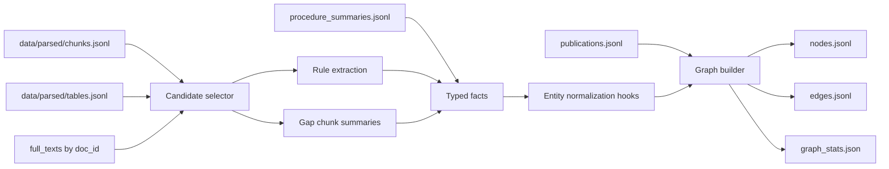

# 02. Summary + Graph

Дата обновления: 2026-07-03.

Статус: активная независимая задача. RAG-реализацию сейчас не трогаем; наша
цель - построить reproducible layer для summaries, typed facts и knowledge
graph, который RAG потом сможет только читать.

## Vision

Мы строим не "еще один RAG", а отдельную структурную проекцию корпуса:

1. Читаем `data/processed/publications/publications.jsonl` и
   `data/processed/publications/procedure_summaries.jsonl`, если они уже
   построены, чтобы `Publication` nodes и procedure cards не извлекались заново
   из каждого chunk.
2. Из parsed chunks/tables/full texts выбираем фрагменты с экспериментами,
   процессами, режимами, свойствами, числами, географией и оборудованием.
3. Для этих фрагментов делаем дополнительные chunk-level summaries только там,
   где document-level `procedure_summaries.jsonl` недостаточно детален.
4. Из summaries и evidence извлекаем typed facts и relations.
5. По ним строим graph строго по сущностям и отношениям из условия задания.
6. Каждый node/edge/fact сохраняет provenance: `doc_id`, `chunk_id`,
   `source_span_id`, evidence span, confidence.

Summary слой нужен для graph и последующей интеграции. Канонические
document-level summaries живут в `data/processed/publications/*`. Graph stage
может добавлять только недостающие chunk-level summaries. Когда RAG будет
готов, он сможет подключить `procedure_summaries.jsonl` как дополнительный
retrieval stream, но это отдельная зона `tasks/03_rag/`.



## Graph Contract

Используем только типы сущностей из условия:

- `Material`
- `Process`
- `Equipment`
- `Property`
- `Experiment`
- `Publication`
- `Expert`
- `Facility`

Используем только типы отношений из условия:

- `uses_material`
- `operates_at_condition`
- `produces_output`
- `described_in`
- `validated_by`
- `contradicts`

Числа, температуры, давления, концентрации, единицы, страны, регионы,
месторождения и confidence не становятся новыми типами узлов. Они хранятся как:

- attributes на node/edge;
- records в `numeric_conditions.jsonl`;
- normalized fields в extraction output;
- evidence/provenance для объяснимости.

## RECIPER Role

RECIPER: A Dual-View Retrieval Pipeline for Procedure-Oriented Materials
Question Answering.

- Локальный PDF: `Литература/Material Science/2604.11229v1.pdf`
- Paper: https://arxiv.org/abs/2604.11229v1
- Code/data: https://github.com/ReaganWu/RECIPER
- Краткий конспект источников:
  [`../../hackathon_plan/sources/source_index.md`](../../hackathon_plan/sources/source_index.md).

Идея, которую берем: кроме обычного paragraph-view, создаем procedure-view.
У нас procedure-view становится не финальным ответом, а структурным источником
для facts и graph edges.

## Inputs

Read-only входы:

- `data/parsed/documents.jsonl`
- `data/parsed/chunks.jsonl`
- `data/parsed/tables.jsonl`
- `data/parsed/full_texts/*.txt`
- `data/parsed/spreadsheets_csv/**/*.csv`
- `data/processed/publications/publications.jsonl` - upstream библиография для
  `Publication` nodes.
- `data/processed/publications/document_summaries.jsonl` - upstream overview
  summaries.
- `data/processed/publications/procedure_summaries.jsonl` - upstream
  RECIPER-style procedure cards.

Командный архив данных:

- https://disk.yandex.ru/d/LmU3jske9NQlOA

## Outputs

Extraction outputs:

- `data/processed/extraction/source_spans.jsonl`
- `data/processed/extraction/entity_mentions.jsonl`
- `data/processed/extraction/numeric_conditions.jsonl`
- `data/processed/extraction/chunk_summaries.jsonl`
- `data/processed/extraction/chunk_procedure_summaries.jsonl` optional, only
  for gaps not covered by upstream publication summaries
- `data/processed/extraction/relations.jsonl`
- `data/processed/extraction/extraction_run_manifest.json`

Graph outputs:

- `data/processed/graph/nodes.jsonl`
- `data/processed/graph/edges.jsonl`
- `data/processed/graph/graph_stats.json`
- `data/processed/graph/graph_export.graphml` later, optional

Все `data/processed/*` не коммитятся.

## JSONL Draft Schemas

`source_spans.jsonl`:

```json
{
  "source_span_id": "span_...",
  "doc_id": "doc_...",
  "chunk_id": "chunk_...",
  "start_char": 120,
  "end_char": 420,
  "text": "evidence text",
  "source_kind": "chunk"
}
```

`chunk_procedure_summaries.jsonl` optional:

```json
{
  "procedure_summary_id": "proc_...",
  "publication_id": "pub_...",
  "doc_id": "doc_...",
  "chunk_id": "chunk_...",
  "source_span_id": "span_...",
  "summary": "Material, process, conditions, output and measured property.",
  "materials": ["Ni alloy"],
  "processes": ["annealing"],
  "conditions": [{"name": "temperature", "value": 900, "unit": "C"}],
  "outputs": ["microstructure"],
  "properties": ["hardness"],
  "confidence": 0.82
}
```

`numeric_conditions.jsonl`:

```json
{
  "condition_id": "cond_...",
  "doc_id": "doc_...",
  "chunk_id": "chunk_...",
  "source_span_id": "span_...",
  "name": "temperature",
  "raw_value": "900 C",
  "value": 900.0,
  "unit": "C",
  "normalized_unit": "K",
  "normalized_value": 1173.15
}
```

`relations.jsonl`:

```json
{
  "relation_id": "rel_...",
  "relation_type": "uses_material",
  "source_entity": {"type": "Experiment", "name": "experiment from doc"},
  "target_entity": {"type": "Material", "name": "Ni alloy"},
  "doc_id": "doc_...",
  "chunk_id": "chunk_...",
  "source_span_id": "span_...",
  "confidence": 0.78
}
```

`nodes.jsonl`:

```json
{
  "node_id": "Material:ni_alloy",
  "node_type": "Material",
  "name": "Ni alloy",
  "aliases": ["nickel alloy"],
  "attributes": {},
  "evidence": [{"doc_id": "doc_...", "chunk_id": "chunk_..."}]
}
```

`edges.jsonl`:

```json
{
  "edge_id": "edge_...",
  "edge_type": "uses_material",
  "source_node_id": "Experiment:exp_...",
  "target_node_id": "Material:ni_alloy",
  "attributes": {},
  "evidence": [{"doc_id": "doc_...", "chunk_id": "chunk_...", "source_span_id": "span_..."}],
  "confidence": 0.78
}
```

## Files We Can Change

Summary/graph зона:

- `app/extract/*`
- `app/graph/*`
- `app/normalization/*` только через согласованный интерфейс нормализации
- `config/extraction/*`
- `config/graph/*`
- `scripts/extract_metadata.py`
- `scripts/build_graph.py`
- `tasks/02_summary_graph/*`

Generated outputs:

- `data/processed/extraction/*`
- `data/processed/graph/*`
- `reports/extraction_*`
- `reports/graph_*`

## Files We Should Not Change

Чтобы не пересекаться с RAG-разработчиком:

- `app/rag/*`
- `app/index/*`
- `config/retrieval/*`
- `scripts/build_indexes.py`
- `scripts/search_cli.py`
- `data/indexes/*`
- `tasks/03_rag/*` без согласования

Чтобы не ломать parsed baseline:

- `data/parsed/*`
- `app/parsing/*` без причины

## Implementation Plan

1. Схемы: добавить Pydantic/dataclass-модели для extraction и graph records.
2. Publication/procedure seed: если есть `publications.jsonl` и
   `procedure_summaries.jsonl`, создать seed map по `doc_id`,
   `publication_id`, `procedure_summary_id`.
3. Candidate selector: найти chunks с признаками process/experiment/condition:
   temperature, pressure, concentration, %, MPa, C, K, h, min, sample,
   experiment, synthesis, annealing, leaching, flotation, deposit, facility.
4. Rule extraction: regex + unit parsing для чисел, температур, давлений,
   концентраций, времени, географии и простых material/property mentions.
5. LLM extraction: YandexGPT Pro 5.1 только для недостающих chunk-level facts
   и summaries; не повторять document-level summary extraction из
   `02_publication_metadata`.
6. Validation: строгая проверка JSON, allowed entity/edge types, confidence
   range, required provenance.
7. Normalization hooks: не делать тяжелую онтологию сразу; ввести adapters для
   material/property/unit/geo normalization.
8. Graph builder: merge mentions в nodes, relations в edges, attach evidence.
9. Quality report: coverage, top node/edge types, missing evidence, conflicts,
   contradiction candidates, examples for manual review.

## Suggested Libraries

- `pydantic` or stdlib `dataclasses` для контрактов.
- `orjson`/`jsonlines` если уже есть в зависимостях, иначе stdlib `json`.
- `regex`/stdlib `re` для rule extraction.
- `pint` для нормализации единиц, если зависимость приемлема.
- `networkx` для локальной сборки и экспорта graph.
- `rapidfuzz` для entity merge/alias matching.
- Yandex AI Studio SDK/API через уже заведенные env-переменные, без вывода
  ключей в логи.

## Smoke Commands

Первый smoke должен работать на малом лимите:

```powershell
.\.venv\Scripts\python.exe scripts\extract_metadata.py --limit 100 --output-dir data\processed\extraction
.\.venv\Scripts\python.exe scripts\build_graph.py --input-dir data\processed\extraction --output-dir data\processed\graph
```

После этого проверить:

- нет неизвестных `node_type` и `edge_type`;
- каждый edge имеет `doc_id`/`chunk_id`/`source_span_id`;
- generated files не попали в git;
- повторный запуск с `--resume` не пересчитывает готовые summaries;
- `graph_stats.json` содержит счетчики nodes, edges, evidence coverage.

## Acceptance Criteria

MVP graph готов для интеграции, если:

- есть валидные `nodes.jsonl`, `edges.jsonl`, `graph_stats.json`;
- graph содержит только 8 типов узлов и 6 типов ребер из условия;
- не менее 95% edges имеют evidence span;
- есть минимум 20-50 вручную проверенных examples по materials/processes/
  properties/experiments;
- contradictions не выдумываются: либо извлекаются с явным evidence, либо
  помечаются как candidates для ручной проверки;
- graph builder использует upstream `procedure_summaries.jsonl` и не требует
  повторной LLM-summary обработки каждого документа;
- RAG может читать graph outputs без импорта `app/graph` internals.
